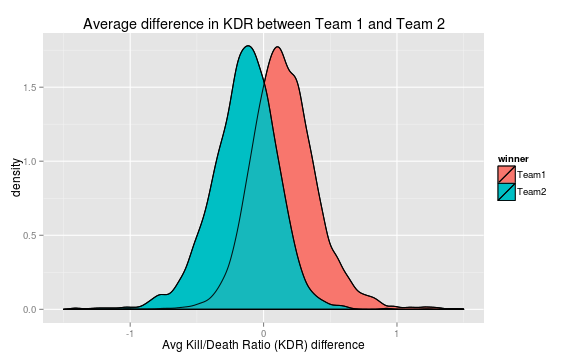
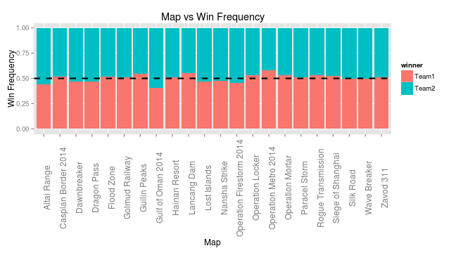

## Predicting Battlefield 4 Conquest Games

Why should we try to predict the outcome of games? 

1. We develop statistical models of factors that are important in determining a winning team
2. We can learn about natural imbalances in the game from historical data
3. We can develop automated server-balancing tools via discrete optimization to 
improve the player experiance

---

## Factors that determine a winning team
- Is it really possible to predict the outcome of a game of conquest using 
historical data? 
- Are there factors that exist that can be used to predict the winning team?

We think: Yes!

- We collected the in-game statistics of 175770 players on PS3 and 
Xbox 360 and 10830 Conquest battle reports
- We computed the average difference of kill/death ratio (KDR) between both teams
- We can predict the outcome of a game of Conquest with 
73.32% accuracy using _only_
KDR

---

It's clear from this figure that we determine factors that can be used for predicting
the outcome of games. KDR is only one of _many_ factors that can be used, and we can expect
improvments in prediction accuracy as we include other correlated factors

---

## Discovering imbalances in games
- We can use historical report data to explore natural imbalances in game design
- By comparing the average number of wins across maps for each team we can estimate balance flaws in
map design

---

## Imrpoving automated team balancing 

- We can use report data and player data to improve automated server balancing so games are not one-sided
- We can train a probabalistic model for $h(t_1, t_2) = P(t_1 \text{Wins} | t_1, t_2 )$ where $t_1, t_2$ are
players for Team 1 and 2 respectively 
- Using discrete optimization algorithms such as branch and bound we can efficiently optimize the player 
grouping of Team 1 and Team 2 to solve: $$\arg\!\min_{t_1,t_2} |h(t_1, t_2)-0.5|$$
- This optimization can naturally include squad constraints
